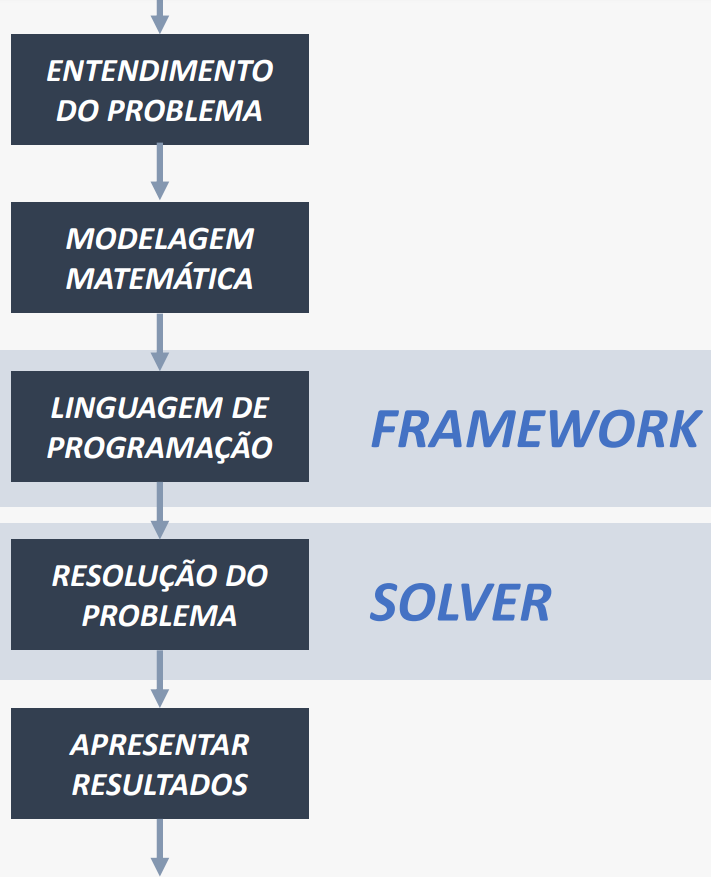
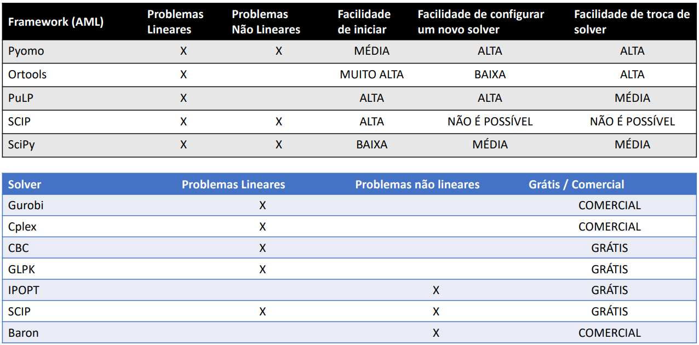
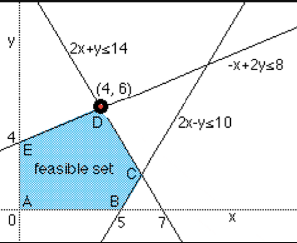
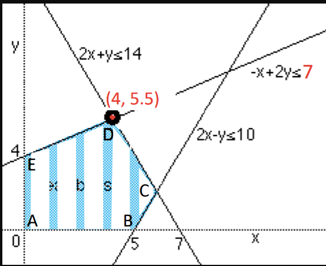
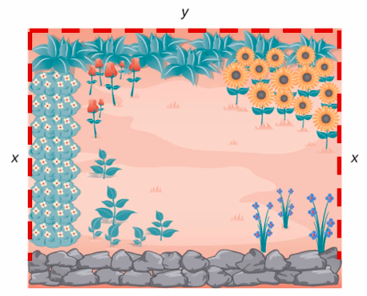
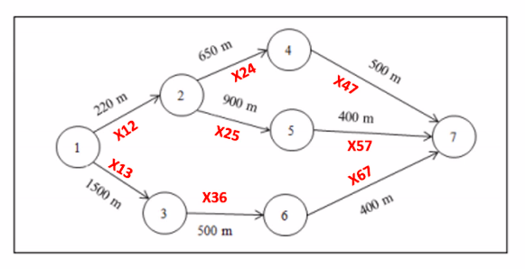
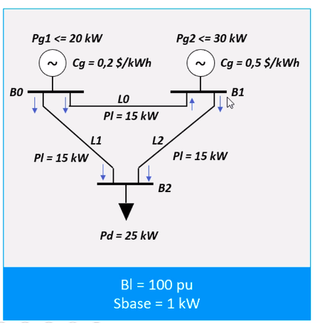

# AI Optimization Overview

## Welcome

This repository, AI-opt-overview, serves as an extensive resource for mastering optimization and programming techniques. Whether you are a beginner or an experienced learner, this repository covers foundational aspects to advanced topics. The goal is to equip participants with a versatile skill set for addressing real-world challenges in optimization and programming.

## Table of Contents

1. [Resources](#resources)
2. [Projects](#projects)
3. [Installing Python and Libraries](#installing-python-and-libs)
   - [IDE](#ide)
   - [Basic Python Commands](#basic-python-commands)
4. [Framework and solvers](#framework-and-solvers)
   - [Macro steps](#macro-steps)
   - [Which framework and solver?](#which-framework-and-solver-select)
6. [Linear Programming](#linear-programming)
   - [Example 1](#example-1)
   - [Solvers and Frameworks](#solvers-and-frameworks)
   - [Resolving LP using OR-Tools](#resolving-lp-using-or-tools)
   - [Resolving LP using SCIP](#resolving-lp-using-scip)
   - [Resolving LP using Gurobi](#resolving-lp-using-gurobi)
   - [Resolving LP using Pyomo with GLPK](#resolving-lp-using-pyomo-with-glpk)
   - [Resolving LP using PuLP](#resolving-lp-using-pulp)
   - [Choosing a Solver](#which-one-choose-for-your-problem)
   - [Advancing with CPLEX, Gurobi using Pyomo](#advancing-with-cplex-gurobi-using-pyomo)
   - [Vector, Matrix, and Sums applied to Electrical Project](#vector-matrix-and-sums-applied-to-electrical-project)
8. [Mixed Linear Integer Problem (MILP)](#mixed-linear-integer-problem)
   - [Example 2](#example-2)
   - [MILP with Pyomo](#milp-with-pyomo)
9. [Nonlinear Programming](#nonlinear-programming)
   - [Example 3](#example-3)
10. [Mixed-Integer Nonlinear Programming (MINLP)](#mixed-integer-nonlinear-programming)
    - [Example 4](#example-4)
    - [Configuring Couenne MINLP solver](#configuring-couenne-minlp-solver)
    - [Decomposition method with Pyomo + MindtPy](#decomposition-method-with-pyomo--mindtpy)
11. [Genetic Algorithm to resolve MINLP](#genetic-algorithm-to-resolve-minlp)
    - [Introduction](#introduction)
    - [Genetic Algorithm Overview](#genetic-algorithm-overview)
    - [Key Components of Genetic Algorithms](#key-components-of-genetic-algorithms)
    - [Example](#example)
12. [Particle Swarm Optimization to resolve MINLP](#particle-swarm-optimization-to-resolve-minlp)
    - [Particle Swarm Optimization Overview](#particle-swarm-optimization-overview)
    - [Key Components of Particle Swarm Optimization](#key-components-of-particle-swarm-optimization)
    - [Application of Particle Swarm Optimization to MINLP](#application-of-particle-swarm-optimization-to-minlp)
    - [Fitness Function](#fitness-function)
    - [Swarm Dynamics](#swarm-dynamics)
    - [Benefits and Considerations](#benefits-and-considerations)
    - [Example](#example)
13. [Constraint Programming (CP)](#constraint-programming-cp)
14. [Some simple application](#some-simple-application)
    - [Garden maximization area](#garden-maximization-area)
    - [Route Optimization between two points](#route-optimization-between-two-points)
    - [Profit maximization car rent](#profit-maximization-car-rent)
    - [Electrical optimal flow](#electrical-optimal-flow)


## Resources

Explore a variety of solvers, frameworks, and libraries to enhance your optimization and programming skills:

**Solvers:** CPLEX – Gurobi – GLPK – CBC – IPOPT – Couenne – SCIP

**Frameworks:** Pyomo – OR-Tools – PuLP

**Libraries:** Geneticalgorithm – Pyswarm – Numpy – Pandas – Matplotlib – Spyder

## Projects

Dive into hands-on projects that apply optimization techniques to real-world scenarios:

- Optimizing the installation of a fence in a garden
- Route optimization
- Maximizing sales revenue in a vehicle rental agency
- Optimal Linear Power Flow: Electrical Systems

## Installing Python and Libs

### Installation of Python and other tools

- [WinPython (portable)](https://winpython.github.io/)
- [Anaconda](https://www.anaconda.com/) to create an environment
- [Python Installation](https://www.python.org/)

**Note:** It's recommended to install [PIP](https://pip.pypa.io/en/stable/installation/) as well.

### Libs Installation

Use the following command to install additional necessary libraries:

```
pip install matplotlib
```

## IDE

For students, it's recommended to use PyCharm based on an academic license. Request the academic license [here](https://www.jetbrains.com/community/education/#students).

### Basic Python Commands

Explore essential Python examples in the "basics" folder, covering arrays, tuples, dictionaries, conditionals, loops, functions, classes, and libraries such as NumPy and Pandas.

## Framework and Solvers

### Macro steps


### Which framework and solver select?



## Linear Programming

Linear programming (LP) is a powerful tool for optimizing linear functions subject to linear constraints. Here are key characteristics and scenarios where LP is commonly applied:

- **Linearity:** All involved functions (objective and constraints) are linear, forming feasible solutions within a convex polyhedron.

- **Optimization Objective:** LP optimizes a linear function (maximize or minimize), valuable for maximizing profits, minimizing costs, or optimizing other linear metrics.

- **Linear Constraints:** Constraints on decisions are linear, expressed through linear inequalities or equations.

- **Quantitative Decisions:** Suitable when decisions can be numerically expressed, and relationships between decisions are proportional.

- **Divisibility and Continuity:** Decision variables are typically continuous and divisible, allowing for fractional units in solutions.

### Example 1



Objective Function: $max$ $x+y$

Constraints:
- $-x+2y\leq8$
- $2x+y\leq14$
- $2x-y\leq10$
- $0 \leq x \leq 10$
- $0 \leq y \leq 10$

Explore LP solvers and frameworks, including OR-Tools, SCIP, Gurobi, Pyomo with GLPK, and PuLP.

### Advancing with CPLEX, Gurobi using Pyomo

Modify the solver in the Pyomo framework by changing the line: `opt = SolverFactory('glpk')` to the desired one, or specify the entire path if not in the ENV PATH.

To install CPLEX, use `pip install cplex` and request the academic license [here](https://www.ibm.com/academic/topic/data-science).

### Vector, Matrix, and Sums applied to Electrical Project

Explore LP modeling for an optimal linear power flow in electrical systems using Pyomo and OR-Tools. The project details are available in the [vector-sum-energy-example](frameworks/pyomo/vector-sum-energy-example.py).

## Mixed Linear Integer Problem (MILP)

MILP extends LP by introducing integer decision variables, adding a discrete element to the optimization process. Here are key characteristics and scenarios where MILP is applied:

- **Linearity with Integer Variables:** MILP retains linearity with some variables constrained to integer values.

- **Combinatorial Decision-Making:** Suitable for problems involving combinatorial decision-making and discrete choices.

- **Optimizing Discrete and Continuous Decisions:** Allows optimization where some decisions are continuous, and others are discrete.

### Example 2

Modify the first example to restrict x to integer values and the UB of constraint one

Objective Function: $max$ $x+y$

Constraints:
- $-x+2y\leq7$
- $2x+y\leq14$
- $2x-y\leq10$
- $0 \leq x \leq 10$
- $0 \leq y \leq 10$
- $x$ assumes integer values



Explore MILP solvers and frameworks, including Pyomo,scip and ortools.

## Nonlinear Programming (NLP)

Nonlinear Programming extends optimization capabilities beyond linear functions, introducing nonlinear relationships in both the objective function and constraints. Here are key attributes and scenarios where NLP is commonly applied:

- **Nonlinearity:** In contrast to linear programming, NLP accommodates nonlinear objective functions and constraints, enabling the modeling of more complex, curved relationships.

- **Optimization Objective:** NLP aims to optimize nonlinear objective functions, allowing for intricate optimization scenarios where linear approximations are insufficient.

- **Nonlinear Constraints:** Constraints in NLP involve nonlinear relationships, offering a more flexible representation of real-world problems compared to linear constraints.

- **Complex Decision Relationships:** Suitable when decisions involve intricate, nonlinear interactions, and the relationship between variables cannot be adequately represented through linear functions.

- **Non-Divisibility and Discontinuity:** Decision variables in NLP may not necessarily be continuous or divisible, allowing for discrete and non-continuous solutions in optimization.

### Example 3

Modify the first example adding non-linearity to first restriction and objective function as bellow:

Objective Function: $max$ $x+y*x$

Constraints:
- $-x+2y*x\leq8$
- $2x+y\leq14$
- $2x-y\leq10$
- $0 \leq x \leq 10$
- $0 \leq y \leq 10$

To resolve it lets use ipopt lib that uses interior point methods and aldo gurobi.
To install it considere the link https://gist.github.com/silgon/0892f410b025f2a82f2b

To resolve this nonlinear problem using scip, we need to do a workaround that can be verified on the implementation.

## Mixed-Integer Nonlinear Programming (MINLP)

**Overview:**
Mixed-Integer Nonlinear Programming (MINLP) is an advanced optimization technique that combines the features of Nonlinear Programming (NLP) with the inclusion of integer variables. This extension allows for the effective optimization of problems involving both continuous and discrete decision variables.

**Nonlinearity:** MINLP accommodates nonlinear objective functions and constraints, providing the capability to model intricate relationships involving both continuous and discrete decision variables.

**Optimization Objective:** Aims to optimize nonlinear objective functions, making it suitable for scenarios where linear approximations are inadequate or impractical.

**Nonlinear Constraints:** Allows for the inclusion of nonlinear constraints, facilitating the representation of real-world problems with complex variable relationships.

**Integration of Discrete Decisions:** Includes integer variables, enabling the modeling of discrete decisions. This is particularly useful for problems where decisions must take on integer values.

**Combinatorial Optimization:** Well-suited for combinatorial optimization problems, such as facility location, network design, and task scheduling with discrete resources.

**Mixed Decisions:** Handles a mix of continuous and integer decision variables, offering flexibility in addressing optimization challenges with diverse decision requirements.

**Non-Divisibility and Discontinuity:** Maintains the capability to handle decision variables that are not necessarily continuous or divisible, crucial for problems with discrete or non-continuous solutions.

### Example 4

Modify the first example adding non-linearity to first restriction, objective function and consider x as integer:

Objective Function: $max$ $x+y*x$

Constraints:
- $-x+2y*x\leq8$
- $2x+y\leq14$
- $2x-y\leq10$
- $0 \leq x \leq 10$
- $0 \leq y \leq 10$
- $x$ integer

#### Configuring Couenne MINLP solver
To install it use the https://github.com/coin-or/Couenne the video https://www.youtube.com/watch?v=f0uwyRaXmcw

#### Decomposition method with Pyomo + MindtPy
Consider the lines ``opt = SolverFactory('mindtpy')`` and ``opt.solve(model, mip_solver='gurobi',nlp_solver='ipopt')``. 

## Genetic Algorithm to resolve MINLP
### Introduction:
Mixed Integer Nonlinear Programming (MINLP) presents challenges in optimization where decision variables can take both continuous and discrete values, and nonlinear relationships exist in both the objective function and constraints. Genetic Algorithms (GAs) offer a heuristic approach to tackling complex MINLP problems by mimicking the process of natural selection.

### Genetic Algorithm Overview:
Genetic Algorithms are optimization algorithms inspired by the principles of natural selection and genetics. They operate on a population of potential solutions, evolving over generations to find optimal or near-optimal solutions to complex problems.

### Key Components of Genetic Algorithms:
1. **Population Initialization:** Generate an initial population of potential solutions with diverse characteristics.

2. **Fitness Evaluation:** Evaluate the fitness of each solution in the population based on the objective function.

3. **Selection:** Select individuals from the population based on their fitness, favoring solutions with higher fitness.

4. **Crossover (Recombination):** Combine genetic material of selected individuals to create new solutions.

5. **Mutation:** Introduce small random changes to selected individuals, promoting diversity.

6. **Termination Criteria:** Define stopping conditions, such as a maximum number of generations or reaching a satisfactory solution.

### Example

In order to resolve this example we need to install the lib:
````
pip install geneticalgorithm
````

## Particle Swarm Optimization to resolve MINLP

## Particle Swarm Optimization Overview:
Particle Swarm Optimization is a population-based optimization technique inspired by the social behavior of birds or particles. It operates by iteratively adjusting the positions of potential solutions in a search space to find optimal or near-optimal solutions.

### Key Components of Particle Swarm Optimization:
1. **Swarm Initialization:** Initialize a swarm of particles representing potential solutions in the search space.

2. **Objective Function Evaluation:** Evaluate the fitness of each particle based on the MINLP objective function, considering both continuous and discrete aspects.

3. **Particle Movement:** Update the position of each particle by combining its previous position, velocity, and the best-known positions of the entire swarm.

4. **Global and Local Search:** Balance exploration and exploitation through global and local searches, allowing particles to navigate towards promising regions.

5. **Termination Criteria:** Define stopping conditions, such as a maximum number of iterations or reaching a satisfactory solution.

## Application of Particle Swarm Optimization to MINLP:

### Fitness Function:
The fitness function assesses the quality of a particle's position based on the MINLP objective function. It must account for both continuous and discrete aspects.

### Swarm Dynamics:
1. **Position Update:**
   - Adjust the position of each particle using its previous position, velocity, and information from the swarm.

2. **Velocity Adjustment:**
   - Modify the velocity of particles to balance exploration and exploitation, preventing premature convergence.

## Benefits and Considerations:
- **Adaptability to Mixed Variables:**
  - PSO naturally handles mixed-type variables, making it suitable for MINLP problems.

- **Exploration-Exploitation Tradeoff:**
  - PSO effectively balances exploration and exploitation, contributing to its success in complex solution spaces.

- **Computational Efficiency:**
  - PSO may demonstrate computational efficiency for certain MINLP problems, especially those with irregular landscapes.

### Example

In order to resolve this example we need to install the lib:
````
pip install pyswarm
````

## Constraint Programming (CP):

CP offers greater flexibility and is particularly effective in handling problems with intricate logical constraints.

Objective Function: $max$ $2x+2y+3z$

Constraints:
- $x+(7)*y+(3)*z\leq50$
- $3*x-5*y+7*z\leq45$
- $5*x+2*y-6*z\leq37$
- $0 \leq x$
- $0 \leq y$
- $0 \leq z$
- $x,y,y$ integers

## Some simple application

### Garden maximization area

What is the biggest area that can be surrounded with a 100m of fence.



Objective Function: $max$ $x*y$

Constraints:
- $2*x+y\leq100$
- $0 \le x$
- $0 \le y$

### Route Optimization between two points

What is the better route, that with less distance, between 2 points.



Objective Function: $min$ $\sum{x_{ij}d_{ij}$

Constraints:
- $\sum_{out}{x_{ij}=1$
- $\sum_{in}{x_{ij}=1$
- $\sum_{out}{x_{ij}\leq1$
- $\sum_{in}{x_{ij}\leq1$
- $\sum_{in}{x_{ij}\leq\sum_{out}{x_{ij}$
- $x_{ij}$ binary

### Profit maximization car rent

Based on history, the location value (p) is between 50 and 200, and the number of car located per day i N(p) = 1001-5p.

Objective Function: $max$ $p*N$

Constraints:
- $N=1001-5*p$
- $50\leq p\leq200$
- $N$ is integer

### Electrical optimal flow

This is a power supply flow circuit, that must be optimized to reduce the costs.



Objective Function: $min$ \sum_g{C_gP_g}$

Constraints:

GitHub's Markdown rendering engine does not natively support LaTeX for mathematical notation. However, you can use alternative methods to display mathematical expressions in a GitHub README.md file.

One common approach is to use an online LaTeX-to-image converter, such as CodeCogs or LaTeXiT, to generate images of your mathematical expressions and then include those images in your README.md. Here is an example:

markdown
Copy code
}}{P_l}+\sum_{l\in\Omega_{n=l(r)}}{P_l}=\sum_{d\in\Omega_{n}}{P_d}, \forall n)
- $P_l=B_l(\theta_{l(n=s)-\theta_{l(n=r)})})), \forall l$
- $0 \leq P_g \leq P_g^{max} \forall l$
- $-P_l^{max} \leq P_l \leq P_l^{max} \forall l$
- $-\pi \leq \theta_n \leq \pi, \forall n$
- $theta_n=0 n:ref(0)$

## References
- https://math.libretexts.org/Courses/Mount_Royal_University/MATH_1200%3A_Calculus_for_Scientists_I/3%3A_Applications_of_Derivatives/3.6%3A_Applied_Optimization_Problems
- https://developers.google.com/optimization/cp/cp_example?hl=pt-br
- https://pythonhosted.org/pyswarm/
- https://pypi.org/project/geneticalgorithm/
- https://github.com/coin-or/Couenne
- https://pyomo.readthedocs.io/en/stable/pyomo_modeling_components/Sets.html#predefined-virtual-sets
- https://developers.google.com/optimization/install/python/source_windows?hl=pt-br
- https://git-scm.com/
- https://cmake.org/
- https://github.com/google/or-tools
- https://github.com/coin-or/Cbc
- https://github.com/coin-or/pulp
- https://sourceforge.net/projects/winglpk/
- https://pyomo.readthedocs.io/en/stable/
- https://www.gurobi.com/
- https://github.com/scipopt/PySCIPOpt
- https://developers.google.com/optimization?hl=pt-br
- https://www.anaconda.com/
