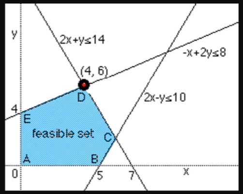

# AI-opt-overview

Embarking on an extensive training journey, this repository covers a spectrum of key topics essential for mastering optimization and programming techniques. It delves into foundational aspects, such as installing Python and associated libraries, as well as getting started with Python. The ideia is to extends to Linear Programming (LP), offering insights into tools like Pyomo and OR-Tools. Additionally, the training delves into advanced areas, including Mixed-Integer Linear Programming (MILP), Nonlinear Programming (NLP), Mixed-Integer Nonlinear Programming (MINLP), and explores heuristic approaches like Genetic Algorithms (GA) and Particle Swarm Optimization. Constraint Programming, a pivotal aspect of optimization, is also a focal point in this comprehensive program. As participants progress, they will gain a versatile skill set to tackle real-world challenges in optimization and programming.

## Resources

Solvers: CPLEX – Gurobi – GLPK – CBC – IPOPT – Couenne – SCIP

Frameworks: Pyomo – OR-Tools – PuLP

Libs: Geneticalgorithm – Pyswarm – Numpy – Pandas – Matplotlib – Spyder

## Projects

- Optimizing the installation of a fence in a garden
- Route optimization
- Maximizing sales revenue in a vehicle rental agency
- Optimal Linear Power Flow: Electrical Systems

## Installing Python and Libs

### Installation of Python and others tools
- WinPython (portable): https://winpython.github.io/
- Anaconda to create environment: https://www.anaconda.com/
- Installation link: https://www.python.org/

PS: Its recommended to install [PIP](https://pip.pypa.io/en/stable/installation/) as well.

### Libs Installation
You can use the following command to install further necessary libs:
```
pip install matplotlib
```

### IDE
If you are a student I recomend you to use PyCharm based on academic license. The academic license can be requested using the link bellow:

https://www.jetbrains.com/community/education/#students

## Basic python commands necessary to develop the projects

In the folder basics you can found some essential python examples using arrays, tuple, dictionary, if, for, while, functions, class  and also other using libs such as numpy, pandas.

## Mathematical Programming

### Linear Programming

Linear programming (LP) exhibits several distinct characteristics that render it suitable for specific problem types. Below are key attributes and scenarios in which linear programming is commonly applied:

**Linearity**: The primary feature lies in the linearity of all involved functions (objective and constraints). This implies that the relationships between variables are proportional, forming feasible solutions within a convex polyhedron.

**Optimization Objective**: Linear programming is employed to optimize (maximize or minimize) a linear function known as the objective. This proves particularly valuable when the goal is to maximize profits, minimize costs, or optimize another linear metric.

**Linear Constraints**: Constraints imposed on the problem are also linear, denoting that limitations on decisions (variables) are expressed through linear inequalities or equations.

**Quantitative Decisions**: Linear programming is apt when decisions can be numerically expressed, and the relationships between these decisions are proportional.

**Divisibility and Continuity**: Decision variables in linear programming are typically continuous and divisible, allowing for fractional units in solutions.

#### Example 1



Objective Function: $max$ $x+y$
Constraints: 

$-x+2y\leq8$

$2x+y\leq14$

$2x-y\leq10$

$0 \leq x \leq 10$

$0 \leq y \leq 10$


